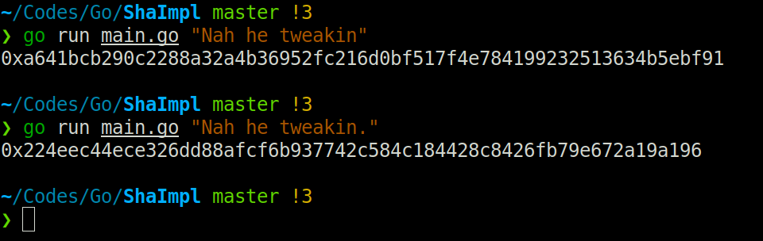

# Sha256-Go-Implementation
A simple implementation of the sha256 hashing algorithm in Go (mainly to learn the 
workings of the algorithm).

## How it works

The algorithm starts with initializing 8 Hash "values", `H0..H7` which will be our final hash after the algorithm reaches the end.

Those `H0..H7`, initially are the first 32 bits of the fractional part of the square roots of the first 8 prime numbers `2..19`. Too much eh?

Next, we define an array `K0..K64` which contains `ints` which are the first 32 bits of the cube roots of the first 64 prime numbers `2..311`. Hmm, you still reading? Nice.

- Pre-processing
    - We begin with the original message (which is a `string`) and convert it to a `byte` slice.
    - After that, we append a `1` to the message. Actually we append `0x80` = `128` to the message to append the `1`.
    - Sha256 requires us to divide the message in 512-bit chunks. We do this by making a `Nx16` Message Array consisting of N 512-bit blocks. We store 16 32-bit (total 512 bits) `ints` inside each block `N`.
    - Then, at last we append a 64-bit integer, which is the length of the original message in bits.

- Hashing Algorithm
    - Here, for each chunk of 512-bits, we create a Message Schedule array `W0..W64` for scrambling.
    - We copy the first 16 words of Message Array into the Message Schedule Array `W0..W6`.
    - Then we extend the 16 words into remaining 48 words by bit manipulation operations.
    - We then initialise 8 working variables `a..h` that will modify the hash values further.
    - The next 64 iterations, changes and swaps and rotates the working variables `a..h`
    - Finally we add those into the values `H0..H7` thus getting the final sha256 hash.

## How it looks

Even appending a `"."` to the original string resulted in a completely different hash value.
That's the beauty of sha256. 